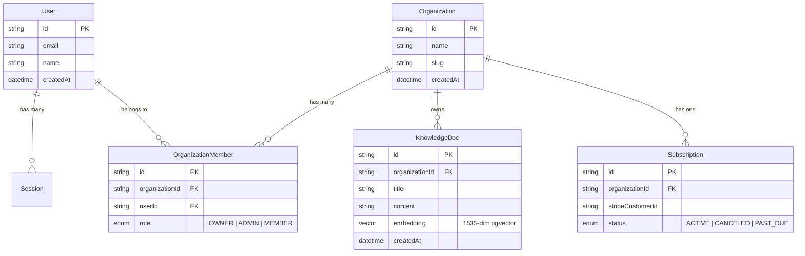

# SparkKit — Architecture Diagrams & Specifications

## 1. High-Level Monorepo Architecture

```
+-----------------------------------------------------------------------------------+
|                                 SparkKit Monorepo                                 |
+-----------------------------------------------------------------------------------+
                                          |
        +---------------------------------+---------------------------------+
        |                                                                   |
+-------v-------+                                                   +-------v-------+
|  apps/web     | (Next.js / Vite Frontend Application)             |  apps/admin   | (Internal Backoffice Dashboard)
+-------+-------+                                                   +-------+-------+
        |                                                                   |
        +---------------------------------+---------------------------------+
                                          |
        +---------------------------------+---------------------------------+
        |                      packages/ (Shared Libraries)                 |
        +---------------------------------+---------------------------------+
        |                                 |                                 |
+-------v-------+                 +-------v-------+                 +-------v-------+
| @sparkkit/core|                 | @sparkkit/auth|                 |  @sparkkit/ai |
| Design Tokens |                 | Better Auth   |                 | Gemini 2.5    |
| UI Components |                 | Passkeys      |                 | RAG / Vector  |
+-------+-------+                 +-------+-------+                 +-------+-------+
        |                                 |                                 |
        +---------------------------------+---------------------------------+
                                          |
                                  +-------v-------+
                                  | @sparkkit/db  |
                                  | Prisma Client |
                                  | PostgreSQL    |
                                  +-------+-------+
                                          |
                                  +-------v-------+
                                  | PostgreSQL DB |
                                  | + pgvector    |
                                  +---------------+
```

---

## 2. Mermaid Package Dependency Diagram

```mermaid
graph TD
    A[apps/web] -->|imports| B[@sparkkit/core]
    A -->|imports| C[@sparkkit/auth]
    A -->|imports| D[@sparkkit/ai]
    A -->|imports| E[@sparkkit/db]

    F[apps/admin] -->|imports| B
    F -->|imports| C
    F -->|imports| E

    D -->|queries embeddings| E
    C -->|stores sessions| E

    E -->|connects| G[(PostgreSQL + pgvector)]
    D -->|invokes| H[Gemini 2.5 API]
```

---

## 3. Database Entity-Relationship Diagram (ERD)



---

## 4. AI Agent RAG Workflow Execution Lifecycle

```
[User Request Prompt]
        |
        v
[1. Express/tRPC API Endpoint (/api/agent)]
        |
        +---> [2. Generate Query Embedding via Gemini Embeddings]
        |
        +---> [3. Perform Similarity Search in PostgreSQL via pgvector]
        |         Query: SELECT * FROM knowledge_docs ORDER BY embedding <=> $1 LIMIT 5
        |
        +---> [4. Construct Augmented Context System Prompt]
        |
        +---> [5. Call Gemini 2.5 Flash LLM with System Context]
        |
        v
[6. Stream Response Tokens & Execution Logs to Client]
```

---

## 5. Security & Isolation Boundaries

- **Client Boundary**: Web browser renders React UI. Zero secrets exposed.
- **API Proxy Boundary**: Express / Node.js backend validates session via `@sparkkit/auth`.
- **Tenant Isolation**: Every database operation enforces `where: { organizationId: session.orgId }`.
- **LLM Gateway**: AI requests sent server-side using `process.env.GEMINI_API_KEY`.
