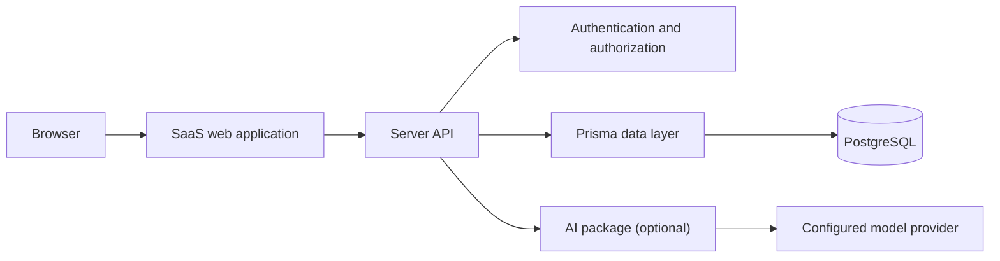

# SparkKit Architecture

## 1. Purpose

SparkKit will be an open-source TypeScript monorepo that contains reusable packages, a project generator, and maintained application templates for SaaS and AI products.

The architecture optimizes for:

- a small, working first release;
- secure defaults;
- replaceable integrations;
- end-to-end type safety;
- a clear boundary between reusable packages and example applications.

## 2. Scope

### Version 0.1

- Turborepo with pnpm workspaces.
- `create-sparkkit` CLI.
- One full-stack SaaS template.
- Email/password or OAuth authentication.
- Organizations, memberships, and three basic roles.
- PostgreSQL and Prisma.
- Optional server-side AI chat.
- Local development with Docker Compose.
- Automated type-checking, tests, and builds.

### Deferred

- Ten-template catalog.
- Passkeys and magic links.
- Stripe subscriptions.
- pgvector and RAG ingestion.
- Visual agent workflow builder.
- Kubernetes deployment.
- Enterprise compliance claims.

## 3. Repository structure

```text
sparkkit/
├── apps/
│   ├── docs/                 # Documentation and product website
│   └── example-saas/         # Reference implementation and test fixture
├── packages/
│   ├── auth/                 # Auth configuration and authorization helpers
│   ├── db/                   # Prisma schema, client, migrations, and seed
│   ├── ai/                   # Server-only model interface and providers
│   ├── ui/                   # Reusable accessible UI components
│   ├── config-eslint/        # Shared lint configuration
│   └── config-typescript/    # Shared TypeScript configuration
├── templates/
│   └── saas/                 # Files copied by the CLI
├── tooling/
│   └── create-sparkkit/      # Published project generator
├── .github/workflows/
├── docker-compose.yml
├── package.json
├── pnpm-workspace.yaml
└── turbo.json
```

## 4. Runtime architecture



The initial template should use one deployable full-stack web application. Splitting the API into a separate service is allowed later, but is unnecessary for version 0.1.

## 5. Package boundaries

### `@sparkkit/db`

Owns the Prisma schema, migrations, generated client, seed data, and database connection lifecycle. It must not contain HTTP or UI logic.

Initial domain models:

- `User`
- `Account`
- `Session`
- `Organization`
- `OrganizationMember`

Billing and knowledge-base models are added only when those features are implemented.

### `@sparkkit/auth`

Owns authentication configuration and authorization helpers. Authorization is enforced on the server.

Required helpers:

- `requireUser`
- `requireOrganization`
- `requireRole`

Roles:

- `OWNER`
- `ADMIN`
- `MEMBER`

### `@sparkkit/ai`

Provides a small provider-neutral server interface. It must never be imported into a browser bundle and must not expose provider API keys.

Initial capabilities:

- text generation or streaming;
- normalized error handling;
- timeouts and cancellation;
- optional usage metadata.

RAG, tools, and agent orchestration remain outside the first interface.

### `@sparkkit/ui`

Contains reusable, accessible presentation components. It must not depend on the database, auth sessions, billing, or AI providers.

### `create-sparkkit`

Copies a versioned template, validates the target directory, installs dependencies when requested, and prints setup instructions. It must work without a SparkKit cloud service.

## 6. Multi-tenancy

Every organization-owned record must include `organizationId`. Server queries must derive the active organization from the authenticated session and verified membership, never solely from client input.

Rules:

1. A user may belong to multiple organizations.
2. Membership is unique per user and organization.
3. Only an owner can transfer ownership.
4. Privileged mutations check roles server-side.
5. Tests must demonstrate that one organization cannot access another organization's records.

Database row-level security may be added later as defense in depth. Application-level authorization is mandatory from the first release.

## 7. API conventions

- Validate all external input with Zod.
- Return stable error codes, not raw internal exceptions.
- Keep secrets and provider SDKs server-side.
- Add request IDs to logs.
- Apply rate limits to authentication and AI endpoints.
- Use explicit authorization checks for every organization-scoped operation.

The initial template may use framework-native route handlers. tRPC is optional and should be adopted only if it measurably improves the starter experience.

## 8. Security baseline

- TypeScript strict mode.
- Secure, HTTP-only, same-site session cookies.
- CSRF protection where required by the chosen auth flow.
- No secrets in `VITE_*`, `NEXT_PUBLIC_*`, or other public variables.
- Environment validation at process startup.
- Passwords handled only by the selected authentication library.
- Dependency updates and secret scanning in CI.
- Redaction of tokens, prompts, and personal data from logs by default.

## 9. Observability

Version 0.1 uses structured application logs with:

- timestamp;
- severity;
- request ID;
- route or operation;
- organization ID when safe;
- duration;
- normalized error code.

Metrics and distributed tracing are later additions. The project should not claim production latency targets until benchmarks exist.

## 10. Architecture decisions

| Decision | Choice | Reason |
|---|---|---|
| Package manager | pnpm | Efficient workspaces and common Turborepo support |
| Monorepo runner | Turborepo | Simple task graph and caching |
| Language | TypeScript | Shared types across tooling and applications |
| Database | PostgreSQL | Strong relational model and future pgvector option |
| ORM | Prisma | Accessible schema and migration workflow |
| First template count | One | Maintains quality and limits support burden |
| AI integration | Optional, server-only | Keeps the core usable without an AI account |
| Billing | Deferred | Avoids coupling the first release to a payment provider |

## 11. Definition of architecture complete

This architecture is considered implemented only when:

- the repository structure exists;
- package boundaries are enforced by imports and tests;
- the generated starter runs from a clean machine;
- tenant isolation tests pass;
- secrets remain server-side;
- CI builds and tests the repository;
- documentation matches the actual code.

