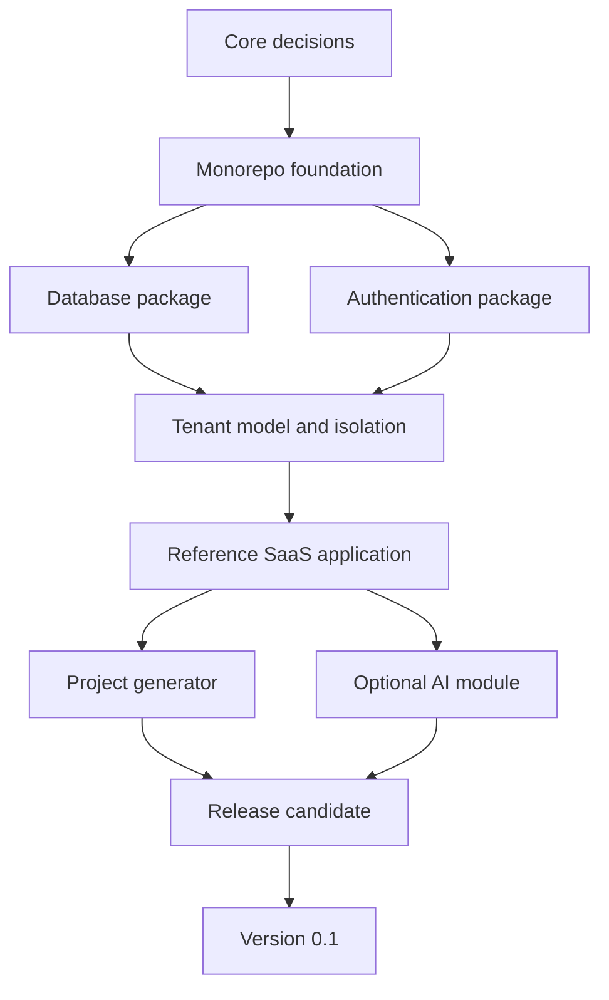

# SparkKit Implementation Plan

## 1. Delivery strategy

Build one vertical slice at a time. Each milestone must leave the repository runnable, tested, and accurately documented. The interactive prototype can remain a vision reference, but it is not evidence that backend features are complete.

## 2. Recommended sequence

### Stage 0 — Resolve core choices

Decide:

- full-stack application framework;
- authentication library and first sign-in methods;
- supported Node.js and pnpm versions;
- test runner and end-to-end test tool;
- open-source license.

Deliverable: short architecture decision records. Avoid implementation until choices that affect the repository shape are settled.

### Stage 1 — Establish the monorepo

1. Create the pnpm workspace and Turborepo task graph.
2. Add strict shared TypeScript configuration.
3. Add linting, formatting, and a minimal test runner.
4. Create empty package boundaries and a small example application.
5. Add CI and dependency caching.

Exit gate:

```powershell
pnpm install --frozen-lockfile
pnpm lint
pnpm typecheck
pnpm test
pnpm build
```

All commands must pass from a clean checkout.

### Stage 2 — Implement data and identity

1. Add PostgreSQL through Docker Compose.
2. Create the initial Prisma models and first migration.
3. Add deterministic seed data.
4. Integrate authentication.
5. Implement organization creation, membership, and role checks.
6. Add tenant-isolation integration tests before building feature pages.

Exit gate: two seeded organizations cannot read or mutate each other's resources through any application operation.

### Stage 3 — Build the reference SaaS application

Build a complete but small flow:

```text
Sign up → Create organization → Create project → Invite/switch context
       → View settings → Sign out and sign back in
```

Use a simple `Project` record as the first organization-owned resource. This exposes the important tenancy and authorization design without prematurely adding billing or AI complexity.

Exit gate: the main user journey and negative authorization cases pass in end-to-end tests.

### Stage 4 — Build and validate the CLI

1. Convert the reference application into a template.
2. Implement safe target-directory handling.
3. Replace template variables deterministically.
4. Support an offline-friendly no-install mode.
5. Run generated-project tests in CI.
6. Perform an npm pack dry run and inspect its contents.

Exit gate: a generated application installs, migrates, seeds, tests, builds, and starts using only generated documentation.

### Stage 5 — Add AI as an optional feature

1. Define a small provider interface.
2. Add a server-only adapter for one provider.
3. Implement streaming chat in the example application.
4. Add limits, cancellation, timeout, rate limiting, and redacted logs.
5. Test with a fake provider.

Exit gate: removing the AI environment variable disables the feature gracefully and does not prevent the rest of the starter from running.

### Stage 6 — Harden and release

1. Add a production multi-stage Dockerfile.
2. Run dependency and secret scans.
3. Review auth, authorization, cookies, input validation, and logs.
4. Test setup on clean machines.
5. Publish a release candidate.
6. Resolve release-blocking feedback.
7. Publish version 0.1.

## 3. Dependency order



## 4. Quality strategy

### Unit tests

- role and permission rules;
- environment parsing;
- CLI input and template transforms;
- AI adapter normalization.

### Integration tests

- Prisma migrations and queries;
- authentication session behavior;
- tenant-scoped data access;
- API validation and error mapping.

### End-to-end tests

- sign-up and sign-in;
- organization onboarding;
- organization switching;
- project CRUD;
- rejected cross-tenant access;
- generated starter smoke test.

### Manual release checks

- Windows, macOS, and Linux setup where contributors are available;
- npm package contents;
- Docker startup and shutdown;
- documentation links and commands;
- absence of real secrets and fabricated product metrics.

## 5. Documentation rules

- Document only implemented behavior.
- Label prototypes, simulations, and future work clearly.
- Every setup command must be exercised in CI or during release testing.
- Each environment variable must state whether it is required, server-only, and what feature uses it.
- Performance and security claims require recorded evidence.

## 6. Scope control

A feature enters version 0.1 only if it supports the first generated SaaS application or the reliability of the generator. Stripe, RAG, additional templates, and workflow orchestration require separate milestones.

When a new idea appears:

1. Add it to the post-0.1 candidates.
2. Write its user outcome.
3. Estimate its new dependencies and maintenance cost.
4. Promote it only after the current release gate passes.

## 7. First working session

The next implementation session should complete Stage 0 and begin Stage 1:

1. Select the full-stack framework and auth library.
2. Select the license.
3. Initialize pnpm and Turborepo.
4. Create shared configuration packages.
5. Add one minimal application.
6. Make the root quality commands pass.

That produces a truthful foundation on which the rest of SparkKit can be built.

