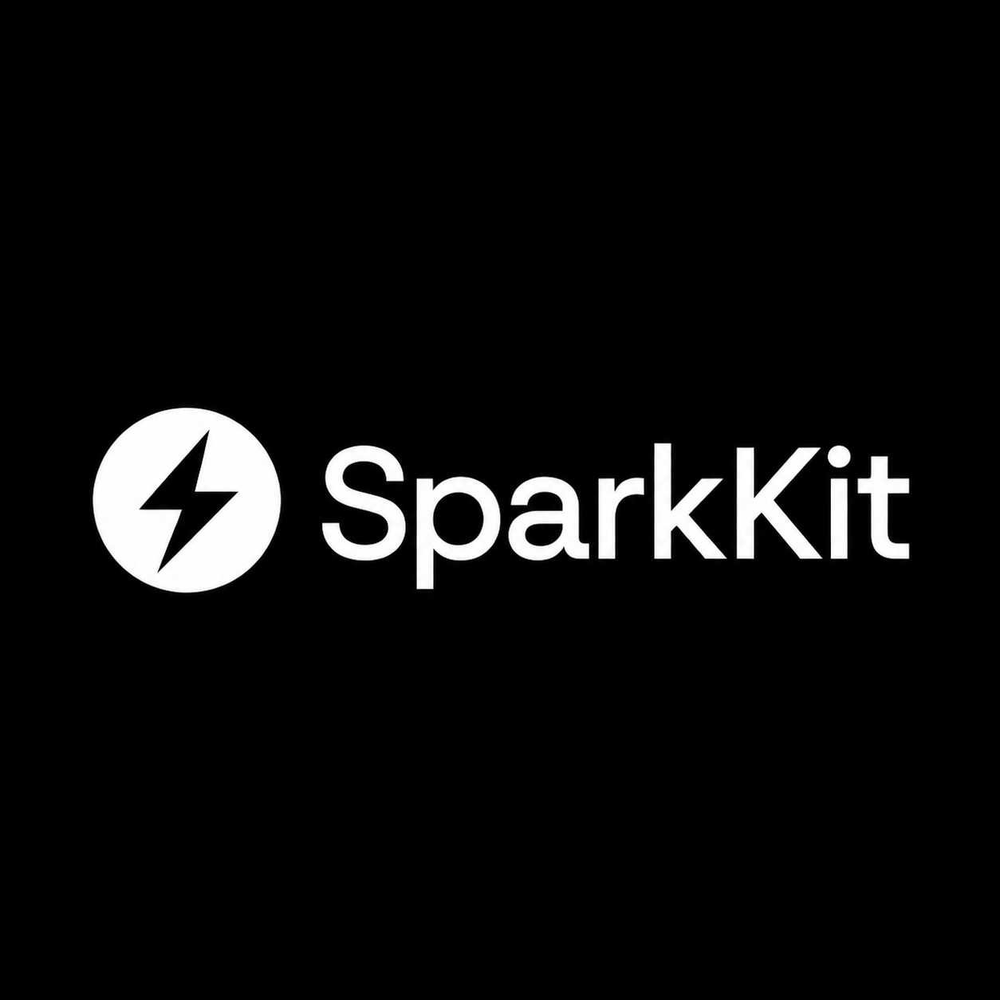
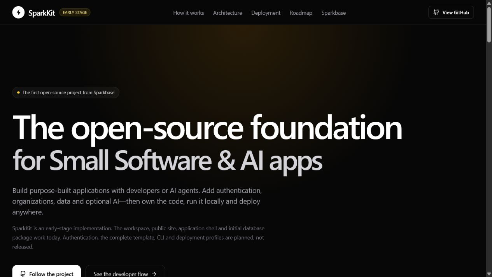

<div align="center">
  

  # Build small software that is ready to become real software.

  SparkKit is an open-source TypeScript foundation for portable SaaS, internal tools,
  and AI-powered applications—with authentication, organizations, tenant-safe data,
  and production-minded defaults built in.

  [](https://github.com/ousssamarahmani/SparkKit-Core-V1/actions/workflows/ci.yml)
  [](./LICENSE)
  [](./TASKS.md)
  [](https://github.com/ousssamarahmani/SparkKit-Core-V1/stargazers)

  [Project site](http://localhost:3000) · [Quick start](#quick-start) · [Architecture](./ARCHITECTURE.md) · [Roadmap](./TASKS.md) · [Contributing](./CONTRIBUTING.md)
</div>

---

<picture>
  
</picture>

> [!IMPORTANT]
> SparkKit is being built in public and has not reached its first stable release.
> The monorepo, project site, application shell, PostgreSQL data layer,
> authentication, organization onboarding, role enforcement, and tenant-owned
> project workflow are implemented today. The generator and optional AI layer are next.

## What is SparkKit?

AI agents make application code dramatically easier to create. They do not make
identity, tenant isolation, permissions, database migrations, testing, or deployment
disappear. SparkKit provides that missing application foundation.

It is designed for **Small Software**: focused products that serve one person, one
team, or a narrow workflow—internal tools, customer portals, operational dashboards,
personal AI tools, vertical applications, and compact SaaS products.

- **Owned and portable.** The generated application is normal TypeScript code that
  stays useful outside any managed platform.
- **Secure by design.** Authentication, organizations, roles, and tenant boundaries
  are part of the foundation.
- **Agent-ready.** Clear conventions help software developers and coding agents work
  on the same codebase safely.
- **AI-optional.** AI capabilities remain modular, server-side, and removable.
- **Cloud-optional.** Run locally or deploy to infrastructure you choose.

| Build with SparkKit | Operate with confidence | Keep your options open |
| --- | --- | --- |
| Start from a coherent application contract instead of rebuilding the foundation. | Treat identity, tenancy, permissions, and verification as product features. | Own ordinary TypeScript code and choose where it runs. |

## Quick start

### Run the project site

```bash
git clone https://github.com/ousssamarahmani/SparkKit-Core-V1.git
cd SparkKit-Core-V1
corepack enable
pnpm install --frozen-lockfile
pnpm dev:docs
```

Open [http://localhost:3000](http://localhost:3000).

### Run the complete local stack

Prerequisites: Node.js 24 or 26, pnpm 11.9.0, Git, and Docker Desktop or another
Docker Compose-compatible runtime.

```bash
pnpm db:up
pnpm --filter @sparkkit/db db:migrate:deploy
pnpm --filter @sparkkit/db db:seed
pnpm dev:web
```

Open [http://localhost:3001](http://localhost:3001). Copy the documented values
from [`.env.example`](./.env.example) when creating your local `.env` file.

## What works today

| Area | Available now |
| --- | --- |
| Foundation | pnpm workspace, Turborepo, strict TypeScript, shared ESLint, CI |
| Data | Prisma, PostgreSQL, migrations, deterministic seeds, tenant isolation |
| Identity | Email/password sessions, sign-in, sign-out, session restoration |
| Teams | Organization onboarding and owner/admin/member authorization |
| Application | Responsive shell, workspace navigation, tenant-owned project CRUD |
| Documentation | Public project site, architecture decisions, security guide, roadmap |

The next verified deliverables are complete empty/error states, end-to-end smoke
tests, local setup documentation, and the `create-sparkkit` generator. See the
[public task backlog](./TASKS.md) for acceptance criteria and implementation evidence.

<details>
<summary><strong>See the current project experience</strong></summary>

<br />



The public project site runs from `apps/docs`; the authenticated reference
application runs independently from `apps/web`.

</details>

## The product direction

```text
Developer or coding agent
          │
          ▼
 SparkKit application foundation
          │
          ├── Next.js application
          ├── Authentication and organizations
          ├── Tenant-safe PostgreSQL data
          ├── Tests and deployment conventions
          └── Optional AI adapters
          │
          ▼
 Infrastructure you choose
          └── Sparkbase managed cloud (planned, optional)
```

**SparkKit** is the open-source standard and application foundation. **Sparkbase**
is the planned managed cloud for deploying, securing, sharing, observing, and
recovering SparkKit applications. SparkKit will remain useful without Sparkbase;
the managed service must earn adoption through convenience rather than lock-in.

### One standard, two paths

| SparkKit | Sparkbase |
| --- | --- |
| Open-source application foundation | Planned managed operations platform |
| Source code the developer owns | Deployment, observability, backups, and recovery |
| Runs locally and on chosen infrastructure | An optional path optimized for convenience |
| Designed for developers and coding agents | Designed for teams using the resulting software |

## Target developer experience

Version 0.1 is working toward a dependable three-command path:

```bash
npx create-sparkkit my-app
cd my-app
pnpm dev
```

The `create-sparkkit` package is **not published yet**. This README will only mark
it available after a generated project installs, tests, builds, and starts on a
clean machine.

## Repository map

```text
apps/
  docs/       Project site and interactive documentation
  web/        Next.js reference application
packages/
  db/         Prisma schema, tenant-safe data access, migrations, and seeds
tooling/
  eslint/     Shared lint configuration
  typescript/ Shared strict TypeScript configuration
docs/
  adr/        Architecture decision records
  articles/   Long-form project writing and artwork
  security/   Security design and operational guidance
```

## Roadmap

- [x] **Foundation** — workspace, shared tooling, governance, and CI
- [x] **Database and tenancy** — PostgreSQL, organizations, memberships, and isolation
- [x] **Identity and authorization** — authentication, onboarding, roles, and sessions
- [ ] **Reference application** — shell and project CRUD complete; UX states and smoke tests remain
- [ ] **Generator** — tested `create-sparkkit` CLI and publishable template
- [ ] **Optional AI** — provider-neutral interface, adapter, streaming example, and tests
- [ ] **Version 0.1** — production container, security review, and clean-machine verification

Detailed work is tracked in [`TASKS.md`](./TASKS.md); sequencing and release gates
live in [`IMPLEMENTATION.md`](./IMPLEMENTATION.md).

## Development

```bash
pnpm lint
pnpm typecheck
pnpm test
pnpm build
```

Run the complete repository gate with `pnpm check`. Database-specific setup and
commands are documented in [`packages/db/README.md`](./packages/db/README.md).

## Contributing

Contributions to code, tests, documentation, design, and examples are welcome.
Before opening a pull request:

1. Read the [contribution guide](./CONTRIBUTING.md) and [code of conduct](./CODE_OF_CONDUCT.md).
2. Check the [current milestone](./TASKS.md) and keep the change focused.
3. Add or update tests for behavior changes.
4. Run `pnpm check` locally.

Please report vulnerabilities privately according to the [security policy](./SECURITY.md).

## Documentation

- [Architecture](./ARCHITECTURE.md) — boundaries, technology choices, and security model
- [Requirements](./REQUIREMENTS.md) — product requirements and release scope
- [Implementation plan](./IMPLEMENTATION.md) — delivery sequence and verification gates
- [Authentication security](./docs/security/authentication.md) — session and endpoint baseline
- [Project thesis](./docs/articles/why-ai-agents-need-an-open-source-foundation-for-small-software.md) — why Small Software needs an open foundation

## License

SparkKit is open source under the [Apache License 2.0](./LICENSE).

<div align="center">
  <strong>Build with SparkKit. Run it anywhere.</strong>
</div>
