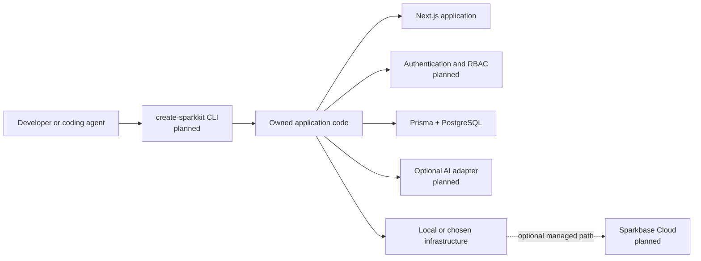

<div align="center">
  

  # The open-source foundation for Small Software and AI-powered applications

  Build portable, production-minded applications with authentication, organizations,
  data boundaries, and optional AI—then own the code and deploy it anywhere.

  [](https://github.com/ousssamarahmani/SparkKit-Core-V1/actions/workflows/ci.yml)
  [](./LICENSE)
  [](./TASKS.md)
  [](https://github.com/ousssamarahmani/SparkKit-Core-V1/stargazers)

  [Architecture](./ARCHITECTURE.md) · [Roadmap](./TASKS.md) · [Contributing](./CONTRIBUTING.md) · [Security](./SECURITY.md)
</div>

> [!IMPORTANT]
> SparkKit is under active development and is not yet a released starter kit.
> The repository foundation, documentation site, Next.js application shell, and
> Prisma database package work today. Authentication, the complete SaaS template,
> and `create-sparkkit` CLI are being built in public.

## Why SparkKit

AI agents and developers can create purpose-built software faster than ever, but
shipping it securely still means rebuilding authentication, tenancy, database
boundaries, testing, and deployment foundations.

SparkKit is focused on **Small Software**: internal tools, team utilities,
personal AI tools, operational dashboards, workflow applications, and focused
SaaS products built for one person or a small group.

It is designed around four promises:

- **Own the code.** Generated applications are portable and remain yours.
- **Secure defaults.** Authentication, authorization, and tenant isolation are
  product requirements—not optional cleanup.
- **Useful with or without AI.** AI capabilities are modular and server-side.
- **Deploy anywhere.** Local development and open infrastructure come first;
  managed services should earn adoption through convenience.

## What works today

| Capability | Status | Location |
| --- | --- | --- |
| pnpm + Turborepo monorepo | Available | Repository root |
| Public SparkKit concept site | Available | [`apps/docs`](./apps/docs) |
| Next.js reference application shell | Available | [`apps/web`](./apps/web) |
| Prisma/PostgreSQL package foundation | Available | [`packages/db`](./packages/db) |
| Shared strict TypeScript and ESLint configuration | Available | [`tooling`](./tooling) |
| CI validation for lint, types, tests, and builds | Available | [GitHub Actions](https://github.com/ousssamarahmani/SparkKit-Core-V1/actions) |
| Authentication, tenancy UI, and project generator | Planned | [Public roadmap](./TASKS.md) |

## Run the repository

### Prerequisites

- Node.js 24 or 26
- pnpm 11.9.0
- Git

```bash
git clone https://github.com/ousssamarahmani/SparkKit-Core-V1.git
cd SparkKit-Core-V1
pnpm install --frozen-lockfile
pnpm check
```

Start the public project site:

```bash
pnpm dev:docs
```

Open [http://localhost:3000](http://localhost:3000). To run the Next.js
reference shell instead, use `pnpm dev:web` and open
[http://localhost:3001](http://localhost:3001).

## Target developer experience

The version 0.1 goal is a working three-command path:

```bash
npx create-sparkkit my-app
cd my-app
pnpm dev
```

This command is **not published yet**. It will only be documented as available
after a generated project installs, tests, builds, and starts on a clean machine.

## Architecture at a glance



The detailed boundaries, security rules, and technology decisions live in
[`ARCHITECTURE.md`](./ARCHITECTURE.md) and [`docs/adr`](./docs/adr).

## Road to version 0.1

- [x] **M0 — Foundation:** monorepo, shared tooling, community files, and CI.
- [ ] **M1 — Data:** organizations, memberships, local PostgreSQL, seeds, and
  tested tenant isolation.
- [ ] **M2 — Identity:** authentication, onboarding, sessions, and role checks.
- [ ] **M3 — Reference SaaS:** one complete organization-aware application.
- [ ] **M4 — Generator:** tested `create-sparkkit` CLI and publishable package.
- [ ] **M5 — Optional AI:** provider-neutral interface and safe streaming example.
- [ ] **M6 — Release:** Docker, security review, clean-machine verification, and
  version 0.1.

See the [task backlog](./TASKS.md) for acceptance criteria and the
[implementation plan](./IMPLEMENTATION.md) for release gates.

## Repository map

```text
apps/
  docs/       Public product and documentation site
  web/        Next.js reference application
packages/
  db/         Prisma schema, generated client, and migration workflow
tooling/
  eslint/     Shared ESLint configurations
  typescript/ Shared strict TypeScript baseline
docs/
  adr/        Architecture decision records
```

## Contributing

SparkKit welcomes focused contributions to code, documentation, testing, design,
and examples. The best place to begin is the current milestone in
[`TASKS.md`](./TASKS.md).

Before opening a pull request:

1. Read the [contribution guide](./CONTRIBUTING.md).
2. Search existing issues and confirm the work fits the current milestone.
3. Keep the change focused and add tests for behavior changes.
4. Run `pnpm check` locally.

Please report vulnerabilities privately according to [`SECURITY.md`](./SECURITY.md).

## SparkKit and Sparkbase

- **SparkKit** is the free, open-source developer toolkit.
- **Sparkbase Cloud** is the planned managed platform for deploying, securing,
  sharing, and operating Small Software.

SparkKit will remain useful without Sparkbase Cloud. The managed platform should
earn adoption through convenience, not lock-in.

## License

SparkKit is available under the [MIT License](./LICENSE).
